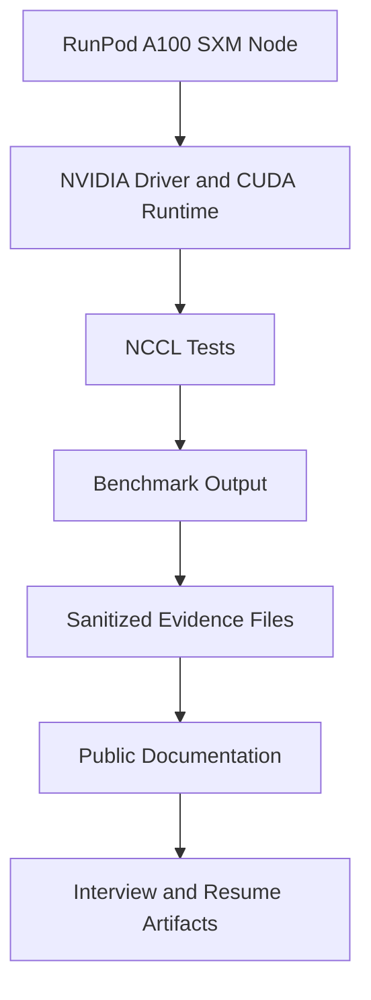
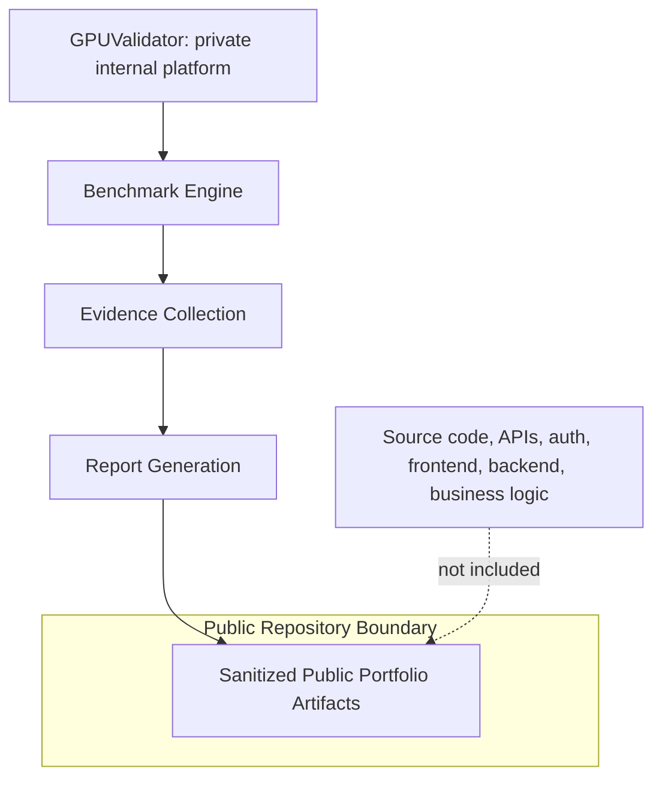

# GPU Benchmark Lab

## Senior AI Infrastructure Engineering Portfolio

**RunPod A100 SXM multi-GPU benchmarking, NCCL methodology, Linux GPU infrastructure validation, evidence collection, and executive reporting.**

> Evidence policy: this public repository contains documentation, sanitized evidence references, screenshots, and report examples only. GPUValidator is a proprietary internal enterprise platform and remains private. No GPUValidator source code, backend, frontend, authentication, agent implementation, APIs, business logic, or enterprise architecture is included.


## Table of Contents

- [Project Overview](#project-overview)
- [Problem Statement](#problem-statement)
- [Objectives](#objectives)
- [Environment](#environment)
- [Hardware](#hardware)
- [Software](#software)
- [Architecture](#architecture)
- [Methodology](#methodology)
- [Benchmarks](#benchmarks)
- [Evidence](#evidence)
- [Results](#results)
- [Reports](#reports)
- [Screenshots](#screenshots)
- [Skills Matrix](#skills-matrix)
- [Lessons Learned](#lessons-learned)
- [Interview Highlights](#interview-highlights)
- [Resume Highlights](#resume-highlights)
- [Future Work](#future-work)

## Project Overview

GPU Benchmark Lab is a public-facing engineering portfolio repository that documents the methodology behind validating AI compute infrastructure on a single-node, multi-GPU RunPod environment. It shows how raw infrastructure and benchmark evidence can be collected, interpreted, documented, and translated into executive-ready validation artifacts without exposing proprietary application source code.

This repository positions **Sabion P. Frazier** as a Senior AI Infrastructure Engineer focused on GPU infrastructure, high-performance Linux systems, NCCL benchmarking, distributed AI systems, evidence-driven validation, and enterprise reporting.

## Problem Statement

Enterprise AI infrastructure teams need more than a green `nvidia-smi` output. They need repeatable validation workflows that answer:

- Are all GPUs visible and correctly inventoried?
- Is the CUDA/NCCL runtime stack identifiable and reproducible?
- Can multi-GPU communication be exercised with known collective patterns?
- Is benchmark evidence preserved in a form suitable for technical review?
- Can raw engineering evidence be transformed into leadership-facing documentation?

## Objectives

- Document a RunPod single-node A100 SXM benchmarking environment.
- Explain NCCL collective benchmarks and their AI infrastructure relevance.
- Preserve raw output references without inventing metrics.
- Show a professional evidence-to-report workflow.
- Provide interview-ready narratives, resume bullets, and STAR stories.
- Keep GPUValidator private while documenting the engineering methodology it supported.

## Environment

| Area | Documented Value |
| :--- | :--- |
| Provider | RunPod |
| Node shape | Single node |
| GPU count | 4 |
| GPU family | NVIDIA A100 SXM |
| Evidence GPU model | NVIDIA A100-SXM4-80GB |
| CUDA | CUDA 12.8 in NCCL evidence header |
| NCCL | NCCL 2.25.1+cuda12.8 in raw evidence |
| Driver | NVIDIA driver 580.126.16 in raw evidence |
| Workload scope | Single-node, multi-GPU communication validation |

See [RunPod setup](docs/RUNPOD_SETUP.md), [GPU hardware](docs/GPU_HARDWARE.md), [CUDA](docs/CUDA.md), and [NCCL](docs/NCCL.md).

## Hardware

The public evidence references a four-GPU A100 SXM class environment. The raw benchmark fixture records:

```text
# GPUs: 4 x NVIDIA A100-SXM4-80GB
# Driver Version: 580.126.16
NCCL version 2.25.1+cuda12.8
```

Source: [redacted-real-nccl-all-reduce.txt](evidence/raw/nccl/redacted-real-nccl-all-reduce.txt).

## Software

- Linux host environment on RunPod
- NVIDIA driver stack
- CUDA runtime/toolkit visibility
- NCCL Tests collective benchmark tooling
- GPUValidator as a private internal platform that generated and organized evidence
- Markdown/PDF documentation outputs for public portfolio review

## Architecture

### Public Evidence Flow



### Proprietary Platform Boundary



More diagrams: [System architecture](docs/SYSTEM_ARCHITECTURE.md).

## Methodology

The methodology is evidence-first:

1. Establish authorized access to a RunPod GPU node.
2. Confirm Linux, NVIDIA driver, GPU inventory, and topology visibility.
3. Run approved NCCL collective benchmarks.
4. Preserve raw output files and screenshots.
5. Document purpose, communication pattern, AI use case, command shape, evidence, output, and lessons learned.
6. Transform technical evidence into reports, resume narratives, and interview stories.

Details: [Benchmark methodology](docs/BENCHMARK_METHODOLOGY.md).

## Benchmarks

| Benchmark | Purpose | Evidence Status | Documentation |
| :--- | :--- | :--- | :--- |
| AllReduce | Aggregate gradients/values across GPUs and distribute result to every rank | Raw redacted real-format output included | [Benchmark results](docs/BENCHMARK_RESULTS.md#allreduce) |
| AllGather | Gather rank-local tensors from all GPUs to all GPUs | Methodology documented; no raw public output included | [Benchmark results](docs/BENCHMARK_RESULTS.md#allgather) |
| ReduceScatter | Reduce across ranks and scatter result shards | Methodology documented; no raw public output included | [Benchmark results](docs/BENCHMARK_RESULTS.md#reducescatter) |
| Broadcast | Send one root tensor to every rank | Methodology documented; no raw public output included | [Benchmark results](docs/BENCHMARK_RESULTS.md#broadcast) |
| Reduce | Reduce all ranks to one root rank | Methodology documented; no raw public output included | [Benchmark results](docs/BENCHMARK_RESULTS.md#reduce) |
| AllToAll | Exchange unique shards between all ranks | Methodology documented; no raw public output included | [Benchmark results](docs/BENCHMARK_RESULTS.md#alltoall) |
| SendRecv | Point-to-point pair communication | Methodology documented; no raw public output included | [Benchmark results](docs/BENCHMARK_RESULTS.md#sendrecv) |

No benchmark metrics are invented. Metrics are quoted only where raw output is present.

## Evidence

Included evidence:

- [Raw NCCL AllReduce output](evidence/raw/nccl/redacted-real-nccl-all-reduce.txt)
- [Screenshot: RunPod agent online](assets/screenshots/runpod/runpod-agent-online.png)
- [Screenshot: RunPod GPU inventory](assets/screenshots/runpod/runpod-gpu-inventory.png)
- [Screenshot: RunPod hardware validation](assets/screenshots/runpod/runpod-hardware-validation.png)
- [Screenshot: RunPod validation results](assets/screenshots/runpod/runpod-validation-results.png)
- [Screenshot: Reports catalog](assets/screenshots/reports/reports-catalog.png)
- [Screenshot: NCCL results reference](assets/screenshots/reports/nccl-results-reference.png)

Evidence manifest: [Benchmark results](docs/BENCHMARK_RESULTS.md#evidence-manifest).

## Results

All numeric benchmark claims in this repository come from the included raw AllReduce evidence:

| Message Size | Algorithm Bandwidth | Bus Bandwidth | Wrong Results |
| :--- | :---: | :---: | :---: |
| 8,388,608 bytes | 26.61 GB/s | 39.91 GB/s | 0 |
| 67,108,864 bytes | 93.19 GB/s | 139.78 GB/s | 0 |
| 1,073,741,824 bytes | 154.69 GB/s | 185.67 GB/s | 0 |
| 8,589,934,592 bytes | 182.76 GB/s | 185.67 GB/s | 0 |

The raw file also reports `# Avg bus bandwidth : 37.3098`. The repository does not reinterpret or normalize that line; it is preserved as source output.

## Reports

This portfolio explains how benchmark evidence can become executive documentation:

- [Executive Summary](docs/reports/EXECUTIVE_SUMMARY.md)
- [Infrastructure Report](docs/reports/INFRASTRUCTURE_REPORT.md)
- [GPU Inventory Report](docs/reports/GPU_INVENTORY_REPORT.md)
- [Customer Validation Report](docs/reports/CUSTOMER_VALIDATION_REPORT.md)
- [Management Report](docs/reports/MANAGEMENT_REPORT.md)

PDF examples are included in [docs/reports/pdf](docs/reports/pdf/). They are public portfolio renderings from sanitized report narratives, not proprietary GPUValidator source output.

## Screenshots

Screenshots are referenced with captions in [Demo guide](docs/DEMO_GUIDE.md) and [Reports documentation](docs/reports/README.md). They are included only as supplied visual evidence; no screenshots were fabricated.

## Skills Matrix

| Domain | Demonstrated Evidence |
| :--- | :--- |
| Linux | Host setup, shell-based validation, command evidence discipline |
| GPU Infrastructure | A100 inventory, driver/runtime awareness, topology validation workflow |
| NVIDIA GPUs | A100 SXM environment documentation and NCCL benchmark interpretation |
| CUDA | CUDA version tracking and runtime evidence linkage |
| NCCL | Collective benchmark methodology and AllReduce evidence analysis |
| Distributed Systems | Collective communication patterns and rank-oriented reasoning |
| RunPod | Cloud GPU deployment workflow and operational validation |
| Python | Evidence parsing/reporting context from internal platform work, without source disclosure |
| TypeScript / React / Node.js / REST APIs | High-level system delivery experience; proprietary implementation not disclosed |
| Benchmarking | NCCL Tests methodology, command discipline, evidence preservation |
| Performance Engineering | Message-size scaling, bandwidth interpretation, correctness checks |
| System Design | Public/private boundary design, evidence pipeline architecture |
| Enterprise Documentation | Executive reports, management summaries, validation reports |
| Infrastructure Validation | Hardware/software inventory, benchmark provenance, acceptance framing |
| Evidence Collection | Raw output preservation, screenshots, sanitized artifacts |
| Cluster Operations / HPC | GPU communication patterns, readiness posture, operational runbooks |
| AI Infrastructure | Multi-GPU compute validation for enterprise AI platforms |

## Lessons Learned

Key lessons are captured in [Lessons learned](docs/LESSONS_LEARNED.md) and case studies under [docs/case-studies](docs/case-studies/).

## Interview Highlights

Use [Interview guide](docs/INTERVIEW_GUIDE.md) for concise talking points around RunPod deployment, NCCL collectives, evidence discipline, proprietary boundaries, and executive communication.

## Resume Highlights

Resume-ready materials are available in:

- [Resume bullets](docs/RESUME_BULLETS.md)
- [Resume project summary](docs/RESUME_PROJECT_SUMMARY.md)

## Future Work

See [Roadmap](ROADMAP.md). Priority improvements before publishing publicly:

- Add customer-approved raw outputs for AllGather, ReduceScatter, Broadcast, Reduce, AllToAll, and SendRecv.
- Add sanitized topology output if approved.
- Add explicit screenshot dates/source notes.
- Add GitHub Actions markdown validation.
- Add a signed evidence manifest if publishing as a formal portfolio artifact.
