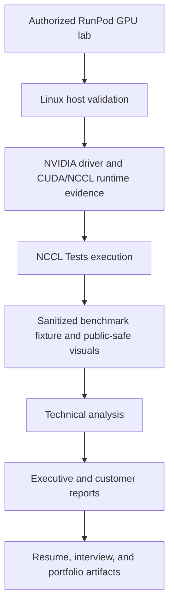
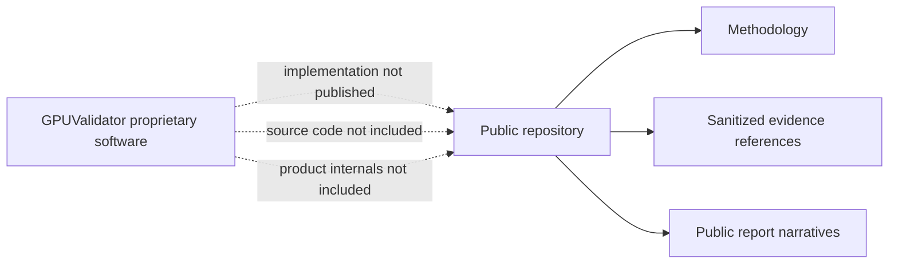

# Engineering an Enterprise GPU Benchmarking and Validation Environment

[](LICENSE)
[](https://github.com/svbion/gpu-benchmark-lab/commits/main)
[](docs/RELEASE_CANDIDATE_AUDIT.md)
[](https://svbion.github.io/gpu-benchmark-lab/)
[](scripts/validate_docs.py)

## Senior AI Infrastructure Engineering Portfolio

**RunPod A100 SXM lab setup, Linux GPU validation, CUDA/NCCL benchmark methodology, evidence discipline, and executive-ready reporting.**

> Public release boundary: this repository documents engineering methodology, sanitized evidence references, benchmark interpretation, and executive reporting. GPUValidator is proprietary software. No source code, product internals, API contracts, database schemas, authentication/RBAC design, agent protocol, customer data, private URLs, secrets, or production screenshots are included.

## First-Time Visitor Path

If you have only a few minutes, review these files in order:

1. [90-second summary](#90-second-executive-summary)
2. [Skills matrix](docs/SKILLS_MATRIX.md)
3. [Benchmark methodology](docs/BENCHMARK_METHODOLOGY.md)
4. [Benchmark results](docs/BENCHMARK_RESULTS.md)
5. [GPUValidator overview](docs/GPUVALIDATOR_OVERVIEW.md)
6. [Launch release notes](docs/releases/v1.0.0.md)
7. [Portfolio landing page](https://svbion.github.io/gpu-benchmark-lab/)

## 90-Second Executive Summary

GPU Benchmark Lab is a launch-candidate portfolio repository showing how an enterprise GPU validation environment was engineered, exercised, documented, and communicated without exposing proprietary platform implementation.

The repository demonstrates:

- Linux-based GPU infrastructure validation on a RunPod single-node, multi-GPU environment.
- NVIDIA A100 SXM hardware awareness and driver/runtime evidence capture.
- CUDA and NCCL version provenance from sanitized benchmark output.
- NCCL collective benchmark methodology with numeric claims limited to included evidence.
- Evidence-to-report translation for technical, customer, management, and interview audiences.
- Clear separation between public methodology and the private GPUValidator platform.

## What This Repository Is

A public engineering case study for:

- Building a controlled GPU benchmark lab.
- Capturing safe evidence from a Linux GPU environment.
- Explaining CUDA/NCCL benchmark methodology.
- Turning technical evidence into customer and executive documentation.
- Demonstrating professional judgment around IP protection.

## What This Repository Is Not

This repository is not GPUValidator source code, a production deployment guide, a customer certification, or a disclosure of proprietary implementation. It does not include private APIs, schemas, auth/RBAC design, agent protocols, message formats, secrets, private URLs, customer data, or production screenshots.

## Recruiter Snapshot

| Signal | Evidence in this repository |
| :--- | :--- |
| Linux | Shell-oriented validation workflow, command provenance, artifact handling |
| HPC / Distributed Systems | NCCL collectives, rank-oriented communication patterns, topology considerations |
| CUDA | Runtime version evidence and compatibility discussion |
| NCCL | AllReduce evidence plus methodology for AllGather, ReduceScatter, Broadcast, Reduce, AllToAll, and SendRecv |
| GPU Infrastructure | A100 inventory, driver/runtime validation, hardware acceptance framing |
| RunPod | Authorized cloud GPU lab setup and operational guardrails |
| Performance Engineering | Message-size scaling, bandwidth interpretation, correctness checks |
| Enterprise Reporting | Executive summaries, customer validation reports, management narratives |
| System Design | Public/private boundary design and evidence pipeline architecture |
| Documentation | Launch-ready docs, validation script, links, image checks, release audit trail |
| AI Infrastructure | Practical validation workflow for multi-GPU AI compute readiness |

## Environment Summary

| Area | Publicly documented value |
| :--- | :--- |
| Provider | RunPod |
| Node shape | Single node |
| GPU count | 4, as shown in the sanitized NCCL fixture header |
| GPU family | NVIDIA A100 SXM class |
| Evidence model string | NVIDIA A100-SXM4-80GB |
| Driver | 580.126.16 in sanitized NCCL fixture header |
| CUDA | CUDA 12.8 in sanitized NCCL fixture header |
| NCCL | NCCL 2.25.1+cuda12.8 in sanitized NCCL fixture header |
| Workload scope | Single-node, multi-GPU collective communication validation |
| Publication status | Launch Candidate 1 / v1.0.0 documentation package |

Source note: the included text artifact is labeled as a redacted real-format fixture. It preserves NCCL Tests output structure and selected non-sensitive values, but it must not be represented as customer evidence.

## Repository Navigation

| Audience | Start here |
| :--- | :--- |
| Recruiter | [Skills matrix](docs/SKILLS_MATRIX.md), [Resume bullets](docs/RESUME_BULLETS.md), [About Sabion](docs/ABOUT_SABION.md) |
| NVIDIA / AI compute interviewer | [Benchmark methodology](docs/BENCHMARK_METHODOLOGY.md), [NCCL](docs/NCCL.md), [Technical decisions](docs/TECHNICAL_DECISIONS.md), [Interview guide](docs/INTERVIEW_GUIDE.md) |
| Enterprise customer | [Executive summary](docs/reports/EXECUTIVE_SUMMARY.md), [Customer validation report](docs/reports/CUSTOMER_VALIDATION_REPORT.md), [Reports catalog](docs/reports/README.md) |
| Investor / acquirer | [GPUValidator overview](docs/GPUVALIDATOR_OVERVIEW.md), [System architecture](docs/SYSTEM_ARCHITECTURE.md), [Roadmap](ROADMAP.md) |
| Portfolio viewer | [GitHub Pages landing page](https://svbion.github.io/gpu-benchmark-lab/), [Demo guide](docs/DEMO_GUIDE.md), [Video walkthrough script](docs/VIDEO_SCRIPT.md) |
| Contributor | [Contributing](CONTRIBUTING.md), [Security](SECURITY.md), [Discussions guide](docs/DISCUSSIONS.md) |

## Public Evidence Flow



## Proprietary Boundary



GPUValidator is mentioned only as proprietary software that supports GPU infrastructure validation workflows. This repository does not disclose how it is implemented.

## Benchmark Coverage

| Benchmark | Public status | Why it matters |
| :--- | :--- | :--- |
| AllReduce | Sanitized fixture rows included | Gradient synchronization and replicated reduction |
| AllGather | Methodology only | Tensor/model-parallel materialization |
| ReduceScatter | Methodology only | Sharded optimizers and memory-efficient reduction |
| Broadcast | Methodology only | Root-to-rank parameter or configuration distribution |
| Reduce | Methodology only | Root-centric metric or loss aggregation |
| AllToAll | Methodology only | Expert-parallel token exchange and distributed transpose |
| SendRecv | Methodology only | Pipeline-parallel and custom point-to-point exchange |

No benchmark metrics are invented. Numeric rows appear only where the included fixture contains them, and the fixture limitations are stated.

## Launch Candidate Contents

| Artifact | Purpose |
| :--- | :--- |
| [Sanitized NCCL AllReduce fixture](evidence/raw/nccl/redacted-real-nccl-all-reduce.txt) | Public-safe example of NCCL Tests output structure |
| [Benchmark results](docs/BENCHMARK_RESULTS.md) | Evidence-linked interpretation and limitations |
| [System architecture](docs/SYSTEM_ARCHITECTURE.md) | Public architecture and proprietary boundary diagrams |
| [Reports](docs/reports/README.md) | Executive/customer/management report examples and regenerated PDFs |
| [Launch candidate audit](docs/RELEASE_CANDIDATE_AUDIT.md) | IP, messaging, link, image, and publication checks |
| [Releases page](RELEASES.md) | Professional release index and v1.0.0 summary |
| [Landing page](https://svbion.github.io/gpu-benchmark-lab/) | GitHub Pages-ready public case study |

## Validation

Local validation command:

```bash
python3 scripts/validate_docs.py
```

Optional PDF regeneration command:

```bash
python3 scripts/render_report_pdfs.py
```

GitHub Actions are included for Markdown validation, Mermaid validation, and link validation.

## Resume Highlights

- Engineered a public-safe GPU benchmarking and validation case study for a RunPod A100 SXM environment, preserving evidence provenance while protecting proprietary platform IP.
- Documented CUDA/NCCL runtime evidence, NCCL collective methodology, and benchmark interpretation for AI infrastructure stakeholders.
- Produced executive and customer-facing validation reports that translate raw infrastructure evidence into readiness, risk, and recommendation narratives.

More: [Resume bullets](docs/RESUME_BULLETS.md) and [Resume project summary](docs/RESUME_PROJECT_SUMMARY.md).

## Launch Status

This repository is prepared as Launch Candidate 1 for public GitHub publication. Review [Launch release notes](docs/releases/v1.0.0.md), [Security](SECURITY.md), and [Release candidate audit](docs/RELEASE_CANDIDATE_AUDIT.md) before making the repository public.
