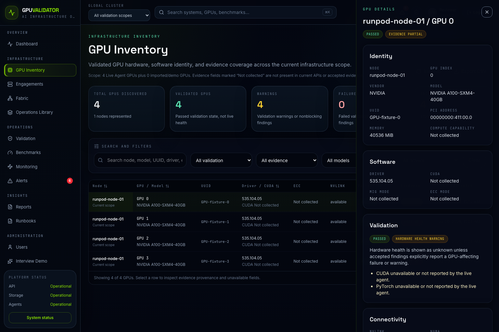
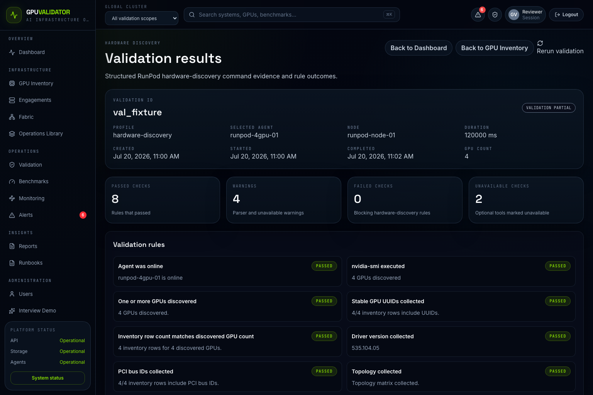

# Demo Guide

> Evidence policy: this public repository contains documentation, sanitized evidence references, screenshots, and report examples only. GPUValidator is a proprietary internal enterprise platform and remains private. No GPUValidator source code, backend, frontend, authentication, agent implementation, APIs, business logic, or enterprise architecture is included.

## Suggested Portfolio Walkthrough

1. Start with the README hero and environment table.
2. Open [Benchmark results](BENCHMARK_RESULTS.md) and show that only AllReduce has raw public output.
3. Open the raw evidence file and point to NCCL, CUDA, driver, GPU count, and correctness fields.
4. Show screenshots to explain the operational workflow.
5. Open [Reports documentation](reports/README.md) to discuss executive communication.
6. Finish with [Resume project summary](RESUME_PROJECT_SUMMARY.md).

## Screenshots and Captions

### RunPod Agent Online

Caption: Supplied screenshot showing the RunPod-oriented validation workflow with an online agent context.

### GPU Inventory

Caption: Supplied screenshot showing GPU inventory presentation for the A100 validation environment.

### Hardware Validation

Caption: Supplied screenshot showing hardware validation workflow context.

### Validation Results

Caption: Supplied screenshot showing validation result review context.

### Reports Catalog

Caption: Supplied screenshot showing report-oriented documentation workflow.

### NCCL Results Reference

Caption: Supplied screenshot showing NCCL result presentation context.
