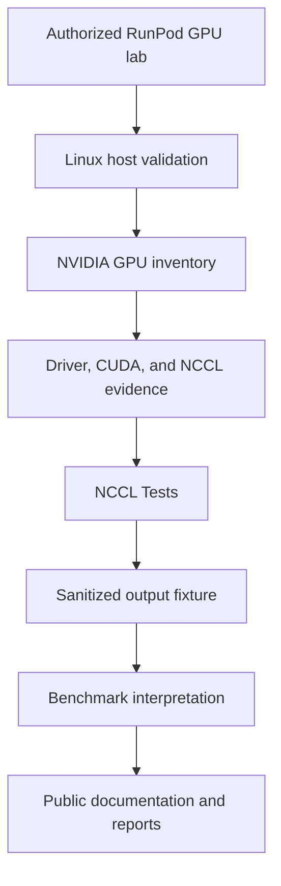
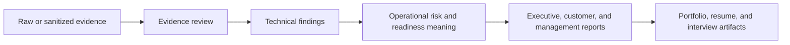
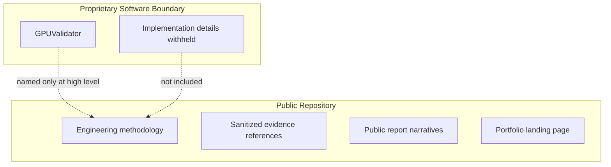

# System Architecture

> Public release boundary: this repository documents engineering methodology, sanitized evidence references, benchmark interpretation, and executive reporting. GPUValidator is proprietary software. No source code, product internals, API contracts, database schemas, authentication/RBAC design, agent protocol, customer data, private URLs, secrets, or production screenshots are included.

## Public Benchmark Lab Architecture

## Evidence-to-Report Architecture

## Proprietary Boundary

## What Is Intentionally Not Published

- Source code or directory structures from GPUValidator.
- API endpoints, database schemas, authentication/RBAC design, agent protocols, message formats, deployment topology, secrets, hostnames, or customer data.
- Production product screenshots.
- Benchmark metrics without public evidence.
