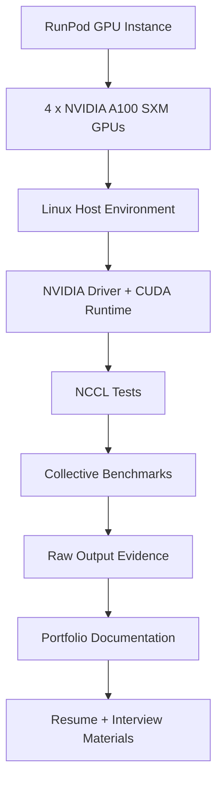
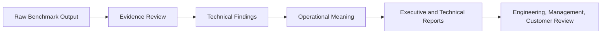
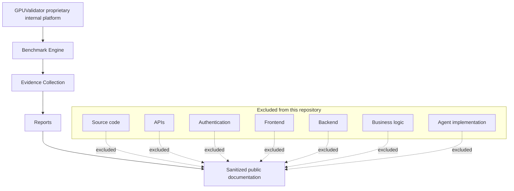

# System Architecture

> Evidence policy: this public repository contains documentation, sanitized evidence references, screenshots, and report examples only. GPUValidator is a proprietary internal enterprise platform and remains private. No GPUValidator source code, backend, frontend, authentication, agent implementation, APIs, business logic, or enterprise architecture is included.

## Public Benchmark Lab Architecture

## Evidence-to-Report Architecture

## Proprietary Boundary

