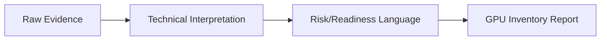

# GPU Inventory Report

> Evidence policy: this public repository contains documentation, sanitized evidence references, screenshots, and report examples only. GPUValidator is a proprietary internal enterprise platform and remains private. No GPUValidator source code, backend, frontend, authentication, agent implementation, APIs, business logic, or enterprise architecture is included.

## Audience

GPU operations and asset management teams

## Purpose

Document GPU count, model family, driver/runtime evidence, and inventory gaps.

## Evidence Inputs

- Raw NCCL benchmark output when available.
- GPU inventory screenshots.
- Hardware validation screenshots.
- Sanitized report examples.

## Transformation Pattern

## Public Example

A portfolio PDF rendering is available in [pdf/GPU_INVENTORY_REPORT.pdf](pdf/GPU_INVENTORY_REPORT.pdf).

## Boundary

This document explains report semantics and evidence mapping. It does not expose proprietary GPUValidator report-generation source code.
